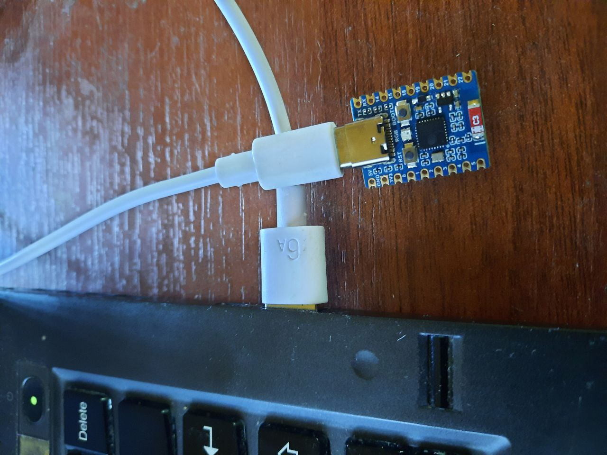

# Esp32c3_test

## Описание
Проект для мигания светодиодом с эффектом сердцебиения на микроконтроллере ESP32C6 и передачи значений синусоиды по COM-порту. Эти значения используются для теста графического интерфейса на базе ImGui, в окне которого рисуются графики синуса.

## Требования
- ESP-IDF (v4.x)
- Микроконтроллер ESP32C6
- Плата разработки ESP32-C6 SuperMini (https://aliexpress.ru/item/1005006917431375.html?sku_id=12000038720440763&spm=a2g2w.productlist.search_results.13.68fb4af2fHbNJE)
- Visual Studio Code (с установленными расширениями)

## Картинка

### Отладочная плата со встроенным uart-usb преобразователем. 

## Сборка и прошивка

1. Установите ESP-IDF, следуя инструкциям на официальном сайте: https://docs.espressif.com/projects/esp-idf/en/latest/esp32/get-started/index.html

2. Установите Visual Studio Code и установите рекомендуемые расширения:
    - `espressif.esp-idf-extension`
    - `ms-vscode.cmake-tools`
    - `ms-vscode.cpptools`
    - `ms-vscode.vscode-serial-monitor`

3. Склонируйте репозиторий:

sh git clone https://github.com/bauman-robotics/esp32c3_test.git cd esp32c3_test
4. Откройте проект в Visual Studio Code:

sh code .

5. Настройте проект:

sh idf.py menuconfig

6. Соберите проект:

sh idf.py build

7. Прошейте микроконтроллер:

sh idf.py flash

8. Мониторинг последовательного порта:

sh idf.py monitor

### Минимальная установка для прошивки бинарного файла

Если вы хотите прошить только бинарный файл и не хотите устанавливать полный набор инструментов ESP-IDF, следуйте этим шагам:

1. Установите `esptool.py`:

sh pip install esptool
2. Скачайте бинарный файл прошивки:
    - [Скачать файл прошивки](http://84.252.143.212:5100/download/esp32c3_test.bin)

3. Подключите вашу плату ESP32-C6 к компьютеру через USB.

4. Определите порт, к которому подключена плата (например, `/dev/ttyACM0` на Linux или `COM3` на Windows).

5. Прошейте микроконтроллер с помощью `esptool.py`:

sh esptool.py --chip esp32c6 --port /dev/ttyACM0 --baud 115200 write_flash -z 0x1000 path/to/your/file.bin
6. Мониторинг последовательного порта:

sh screen /dev/ttyUSB0 115200

## Использование

### Конфигурация RGB светодиода

Для платы разработки ESP32-C6 SuperMini, RGB светодиод управляется по SPI через GPIO_NUM_8:

- Данные (Data): GPIO_NUM_8

### Передача значений синусоиды

Функция `send_sine_values` передает значения синусоиды по COM-порту каждые 10 миллисекунд:

c static void send_sine_values(void) { static uint32_t s_time = 0;

// Calculate the current time position in the cycle
float t = (float)(s_time % SIN_PERIOD_MS) / SIN_PERIOD_MS * 2 * M_PI;
int32_t sine_value = (int32_t)((sin(t) * (AMPLITUDE / 2)) + (AMPLITUDE / 2));

// Log the sine value
ESP_LOGI(TAG, "data %" PRId32, sine_value);

s_time += (SIN_PERIOD_MS / SIN_VALUES_COUNT); // Increment time

}
### Основная функция

Функция `app_main` инициализирует светодиод и запускает цикл передачи значений синусоиды и мигания светодиода:

c void app_main(void) { configure_led();

// Установите свою функцию временных меток
esp_log_set_vprintf(my_log_vprintf);

while (1) {
    send_sine_values();
    blink_led();
    vTaskDelay(10 / portTICK_PERIOD_MS); // Update every 10 milliseconds
}

}

### Формат данных

Данные передаются по COM-порту в следующем формате:

I (6809) esp32: data 468 

Где:
- `I` - уровень логирования (информация).
- `(6809)` - временная метка в миллисекундах.
- `esp32:` - тэг логирования.
- `data` - ключевое слово.
- `468` - значение синусоиды.

### Графический интерфейс на базе ImGui

Для отображения графиков синусоиды, принимаемой по COM-порту, используйте ImGui в вашем приложении на ПК. 

## Файлы
- `main.c`: Основной файл с кодом проекта.
- `sdkconfig`: Файл конфигурации проекта.
- `CMakeLists.txt`: Файл сборки проекта.

## Бинарные файлы

Бинарные файлы можно скачать по следующей ссылке:

- [Скачать файл](http://84.252.143.212:5100/download/esp32c3_test.bin)
